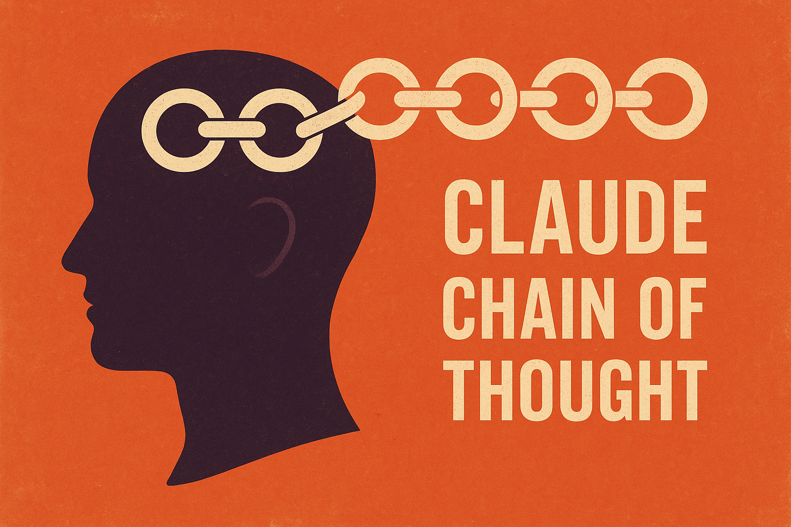

<div align="center">



# 🧠 Unified Chain of Thought Framework

### ✨ Enhanced systematic cognitive framework for Claude Code - making every interaction smarter, structured, and more effective

[](https://github.com/shadowdevnotreal/unified-cot-framework)
[](LICENSE)
[](https://github.com/shadowdevnotreal/unified-cot-framework)
[](https://claude.ai/code)
[](https://github.com/shadowdevnotreal/unified-cot-framework)
[](#-quick-start)

**📚 [Documentation](#-documentation) | 🚀 [Quick Start](#-quick-start) | 🤖 [Specialized Agents](#-specialized-agents) | 💬 [Contributing](CONTRIBUTING.md)**

*A comprehensive, globally-available cognitive toolkit with specialized agents for code review, testing, and security - enabling systematic thinking and structured problem-solving across all Claude Code projects.*

</div>

---

## 🎯 **What is the Unified CoT Framework?**

The **Unified Chain of Thought (CoT) Framework™ v2.0** is the next evolution of systematic cognitive enhancement for Claude Code. Powered by Diatasso™ PRCM™ methodology, it merges the best practices from the original CoT framework with production-ready installation, enhanced agent capabilities, and enterprise-grade tooling.

### 🌟 **Core Value Proposition**

**Problem:** Claude Code interactions can lack systematic structure, making complex tasks inconsistent and difficult to validate. Teams need specialized expertise for code review, testing, and security.

**Solution:** A unified framework that provides:
- **Structured Cognitive Processes** - Battle-tested 4-step and 5-step frameworks
- **Scalable Thinking Intensity** - Match cognitive effort to problem complexity
- **Specialized Agent Library** - Code Review, Testing, Security, Architecture
- **One-Command Installation** - Production-ready setup in seconds
- **Universal Availability** - Works in every project automatically
- **Enhanced Error Handling** - Robust installation with verification

### 🧠 **What's New in v2.0**

```
✅ Unified codebase (merged original + GitHub versions)
✅ Enhanced installation with cross-platform support
✅ NEW: Code Review Agent (quality, security, performance)
✅ NEW: Test Engineer Agent (coverage, automation, edge cases)
✅ NEW: Security Auditor Agent (OWASP Top 10, vulnerability scanning)
✅ Enhanced Team Architect Agent
✅ Improved error handling and validation
✅ Comprehensive documentation and examples
✅ Backup and uninstall capabilities
✅ Shell alias support (bash, zsh, fish)
```

---

## 🚀 **Quick Start**

### Installation (One Command)

```bash
cd /path/to/unified-cot-framework
./install.sh
```

That's it! The framework is now available globally in all Claude Code sessions.

### First Steps After Installation

```bash
# Reload your shell
source ~/.bashrc  # or ~/.zshrc

# View quick reference
cot-docs

# List available agents
cot-agents

# Check version
cot-version
```

### Basic Usage

```bash
# Standard thinking (5-15 seconds)
cot Review this pull request for quality issues

# Enhanced thinking (20-45 seconds)
cot+ Design a microservices architecture for user authentication

# Maximum thinking (45-180 seconds)
cot++ Conduct comprehensive security audit of payment processing module
```

---

## 📋 **Framework Overview**

### Universal 4-Step Framework

For general problem-solving, analysis, and decision-making:

```
LISTEN → THINK → REASON → RESPOND
```

**Phase Breakdown:**

1. **🎯 LISTEN** - Active information gathering
   - Complete input comprehension
   - Identify explicit vs implicit requirements
   - Flag ambiguities and establish context

2. **🧠 THINK** - Chain of Thought systematic breakdown
   - Organize information (facts vs assumptions)
   - Map cause-and-effect relationships
   - Recognize patterns and build logical progression

3. **🎨 REASON** - Chain of Reasoning validation
   - Verify logic consistency
   - Explore alternative approaches
   - Detect and mitigate cognitive biases
   - Calibrate confidence with uncertainty quantification

4. **📋 RESPOND** - Synthesis and clear delivery
   - Provide executive summary with step-by-step reasoning
   - State explicit confidence levels
   - Document alternatives considered
   - Outline actionable next steps

**Best For:** Strategic decisions, complex analysis, research, problem decomposition

---

### Coding 5-Step Framework

For software development tasks with enhanced validation:

```
ANALYZE → PLAN → VALIDATE → IMPLEMENT → CONFIRM
```

**Phase Breakdown:**

1. **📊 ANALYZE** - Requirements and context understanding
   - Parse requirements and constraints
   - Review existing codebase patterns
   - Identify dependencies and impacts

2. **🗺️ PLAN** - Technical design and approach
   - Define implementation strategy
   - Break down into logical components
   - Identify potential challenges
   - Document key decisions

3. **✅ VALIDATE** - Pre-implementation logic verification
   - Verify approach against requirements
   - Check for edge cases and error scenarios
   - Validate assumptions before coding
   - Review security and performance implications

4. **⚙️ IMPLEMENT** - Code execution with verification
   - Write clean, maintainable code
   - Follow established patterns
   - Add comprehensive error handling
   - Include inline documentation

5. **🔍 CONFIRM** - Quality assurance and completion
   - Verify all requirements met
   - Check edge cases and error handling
   - Review code quality and style
   - Ensure tests pass and coverage adequate

**Best For:** Feature implementation, bug fixes, refactoring, code optimization

---

## 🎚️ **Intensity Levels**

Match cognitive effort to problem complexity:

| Level | Command | Tokens | Time | Use When |
|-------|---------|--------|------|----------|
| **Standard** | `cot` | 4,000 | 5-15s | Simple tasks, clear requirements |
| **Enhanced** | `cot+` | 10,000 | 20-45s | Complex logic, multiple considerations |
| **Maximum** | `cot++` | 31,999 | 45-180s | Critical decisions, security audits |

**Progressive Escalation:**
- Start with `cot` for most tasks
- Escalate to `cot+` if complexity emerges
- Use `cot++` for mission-critical analysis

---

## 🤖 **Specialized Agents**

### 1. Team Architect Agent

**Purpose:** Design and orchestrate multi-agent systems for complex projects

**Capabilities:**
- Multi-agent team design
- Workflow orchestration
- Task delegation strategies
- Inter-agent communication protocols

**Usage:**
```bash
# Design agent team for project
cot+ /use agent-team-architect "Design multi-agent system for e-commerce platform"
```

**Location:** `~/.claude/agents/agent-team-architect.md`

---

### 2. Code Review Agent 🆕

**Purpose:** Comprehensive code quality, security, and performance analysis

**Capabilities:**
- Code quality assessment
- Security vulnerability detection
- Performance bottleneck identification
- Best practices enforcement
- Test coverage evaluation

**Review Categories:**
- 🚨 **CRITICAL** - Must fix before merge
- ⚠️ **WARNING** - Should fix before merge
- 💡 **SUGGESTION** - Consider for improvement
- ✅ **PRAISE** - Well-done implementations

**Usage:**
```bash
# Quick PR review
cot /use agent-code-reviewer "Review PR #123"

# Comprehensive security review
cot+ /use agent-code-reviewer "Review authentication module for security issues"

# Deep audit
cot++ /use agent-code-reviewer "Audit payment processing for vulnerabilities"
```

**Location:** `~/.claude/agents/agent-code-reviewer.md`

---

### 3. Test Engineer Agent 🆕

**Purpose:** Comprehensive testing strategy, test generation, and coverage analysis

**Capabilities:**
- Test case generation (unit, integration, E2E)
- Edge case identification
- Test coverage analysis
- Test automation implementation
- Flaky test detection and remediation

**Test Pyramid:**
- **Unit Tests:** 80-90% code coverage
- **Integration Tests:** 60-70% integration paths
- **E2E Tests:** Critical user journeys

**Usage:**
```bash
# Generate test cases
cot /use agent-test-engineer "Generate test cases for user registration feature"

# Implement full test suite
cot+ /use agent-test-engineer "Implement comprehensive tests for payment processor"

# Audit existing tests
cot++ /use agent-test-engineer "Analyze test suite quality and identify gaps"
```

**Location:** `~/.claude/agents/agent-test-engineer.md`

---

### 4. Security Auditor Agent 🆕

**Purpose:** Security vulnerability assessment and OWASP compliance checking

**Capabilities:**
- OWASP Top 10 assessment
- Vulnerability detection and classification
- Threat modeling (STRIDE)
- Security testing scenarios
- Compliance checking (PCI-DSS, GDPR)

**Severity Levels:**
- 🔴 **CRITICAL** - Immediate action required
- 🟠 **HIGH** - Fix before production
- 🟡 **MEDIUM** - Schedule for fix
- 🔵 **LOW** - Address when possible
- ⚪ **INFO** - Awareness only

**OWASP Top 10 Coverage:**
- A01: Broken Access Control
- A02: Cryptographic Failures
- A03: Injection
- A04: Insecure Design
- A05: Security Misconfiguration
- A06: Vulnerable Components
- A07: Authentication Failures
- A08: Software/Data Integrity Failures
- A09: Logging/Monitoring Failures
- A10: Server-Side Request Forgery

**Usage:**
```bash
# Quick security scan
cot+ /use agent-security-auditor "Scan authentication.js for vulnerabilities"

# Full OWASP audit
cot++ /use agent-security-auditor "Complete OWASP Top 10 assessment of API layer"

# Dependency check
cot /use agent-security-auditor "Check dependencies for known vulnerabilities"
```

**Location:** `~/.claude/agents/agent-security-auditor.md`

---

## 📁 **Installation Details**

### What Gets Installed

```
~/cot-framework/              # Framework documentation
├── docs/                     # Core framework files
│   ├── cot.md               # Universal 4-step framework
│   ├── cot-expanded.md      # Coding 5-step framework
│   ├── cot-quick-reference.md
│   └── unified-cot-system.md
├── examples/                 # Real-world usage examples
│   ├── 01-code-analysis-basic.md
│   ├── 02-feature-implementation-enhanced.md
│   ├── 03-complex-debugging-maximum.md
│   └── 04-agent-team-design.md
├── README.md                 # This file
└── LICENSE                   # MIT License

~/.claude/                    # Claude Code configuration
├── GLOBAL_COT_FRAMEWORK.md  # Auto-loaded in all sessions
└── agents/                   # Specialized agent library
    ├── agent-team-architect.md
    ├── agent-code-reviewer.md
    ├── agent-test-engineer.md
    └── agent-security-auditor.md
```

### Shell Aliases Created

```bash
cot-docs     # View quick reference guide
cot-read     # View global framework file
cot-full     # Navigate to framework directory
cot-agents   # List available agents
cot-version  # Show framework version
```

### Platform Support

- ✅ **Linux** (Ubuntu, Debian, Fedora, etc.)
- ✅ **macOS** (Intel & Apple Silicon)
- ✅ **Windows WSL** (WSL 1 & 2)
- ✅ **Bash** shell support
- ✅ **Zsh** shell support
- ⚠️ **Fish** shell (partial - manual alias configuration needed)

---

## 🔧 **Advanced Usage**

### Combining Agents and Frameworks

```bash
# Code review with enhanced thinking
cot+ /use agent-code-reviewer "Review refactored authentication module"

# Security audit with maximum depth
cot++ /use agent-security-auditor "Full security assessment of API gateway"

# Test generation with validation
cot+ /use agent-test-engineer "Create E2E tests for checkout flow"

# Multi-agent orchestration
cot++ /use agent-team-architect "Design agent team for microservices migration"
```

### Workflow Integration

**Pre-commit Code Review:**
```bash
git add .
cot /use agent-code-reviewer "Review my staged changes"
```

**Security Check Before Merge:**
```bash
cot+ /use agent-security-auditor "Scan PR #456 for vulnerabilities"
```

**Test Coverage Validation:**
```bash
cot /use agent-test-engineer "Analyze current test coverage and identify gaps"
```

---

## 📊 **Examples**

### Example 1: Feature Implementation (Enhanced)

```
User: Implement user authentication with JWT tokens

Claude with cot+:

ANALYZE {
  Requirements:
    - User login/logout functionality
    - JWT token generation and validation
    - Secure password handling
    - Session management

  Context:
    - Existing Express.js API
    - MongoDB database
    - No auth currently implemented
}

PLAN {
  Components:
    1. User model with password hashing
    2. Authentication middleware
    3. Login/logout endpoints
    4. JWT token utilities
    5. Environment-based secrets

  Security Considerations:
    - bcrypt for password hashing
    - httpOnly cookies for tokens
    - CSRF protection
    - Rate limiting on auth endpoints
}

VALIDATE {
  Edge Cases:
    - Invalid credentials handling
    - Token expiration
    - Concurrent sessions
    - Password reset flow

  Security Checks:
    - No passwords in logs
    - Secure token storage
    - XSS prevention
}

IMPLEMENT {
  [Clean, well-documented implementation]
}

CONFIRM {
  ✅ All requirements met
  ✅ Security best practices followed
  ✅ Error handling comprehensive
  ✅ Tests passing
  ✅ Documentation complete
}
```

### Example 2: Security Audit (Maximum)

```
User: Audit our payment processing module

Claude with cot++ and Security Auditor:

[Comprehensive OWASP Top 10 analysis]
[STRIDE threat modeling]
[Vulnerability assessment with CVE references]
[Risk scoring and prioritization]
[Detailed remediation recommendations]

Findings:
🔴 CRITICAL: SQL injection in transaction query (CWE-89, CVSS 9.8)
🟠 HIGH: Missing input validation on amount field
🟡 MEDIUM: Weak session management
🔵 LOW: Information disclosure in error messages

Recommendations:
1. Immediate: Fix SQL injection (2 hours)
2. Week 1: Input validation (4 hours)
3. Week 2: Session hardening (6 hours)
4. Week 3: Error handling review (2 hours)
```

---

## 🛠️ **Maintenance**

### Update Framework

```bash
cd /path/to/unified-cot-framework
git pull  # If using git
./install.sh  # Reinstall (automatically backs up existing)
```

### Backup Before Changes

The installer automatically creates timestamped backups:
```
~/cot-framework.backup.YYYYMMDD_HHMMSS/
~/.claude/agents.backup.YYYYMMDD_HHMMSS/
```

### Uninstall

```bash
cd /path/to/unified-cot-framework
./uninstall.sh
```

The uninstaller will:
- Create a backup before removal
- Remove all framework files
- Clean up shell aliases
- Preserve your data in backup directory

---

## 📚 **Documentation**

### Core Framework Docs
- **cot.md** - Universal 4-step framework (detailed)
- **cot-expanded.md** - Coding 5-step framework (detailed)
- **cot-quick-reference.md** - One-page cheat sheet
- **unified-cot-system.md** - System architecture

### Agent Documentation
- **agent-team-architect.md** - Multi-agent system design
- **agent-code-reviewer.md** - Code review methodology
- **agent-test-engineer.md** - Testing strategies
- **agent-security-auditor.md** - Security assessment

### Examples
- **01-code-analysis-basic.md** - Code analysis walkthrough
- **02-feature-implementation-enhanced.md** - Feature dev example
- **03-complex-debugging-maximum.md** - Deep debugging
- **04-agent-team-design.md** - Multi-agent orchestration

---

## 🤝 **Contributing**

We welcome contributions! Please see [CONTRIBUTING.md](CONTRIBUTING.md) for guidelines.

### Areas for Contribution
- Additional specialized agents
- Enhanced examples and use cases
- Platform-specific improvements
- Documentation improvements
- Bug reports and fixes

---

## 📝 **License & Trademarks**

### Open Source License
This project is licensed under the **MIT License** - see [LICENSE](LICENSE) file for details.

The framework code, installation scripts, and documentation are freely available for use, modification, and distribution under MIT terms.

### Trademark Notice

**Protected Marks:**
- **Diatasso™** - Registered service mark (Tennessee Secretary of State, April 18, 2022)
- **PRCM™** - Protected methodology trademark
- **Chain of Thought (CoT) Framework™** - Framework name trademark

**Proper Usage:**
- ✅ Use marks with ™ symbol when referencing
- ✅ Attribute to Diatasso LLC when appropriate
- ✅ Use in documentation and discussions
- ❌ Do not imply endorsement or affiliation without permission
- ❌ Do not remove or modify trademark notices

For detailed trademark guidelines, see project documentation.

### Dual Protection Model
- **Open Source Code:** MIT License (freely usable)
- **Trademarks & Methodologies:** Protected by Diatasso LLC
- **PRCM™ Framework:** Proprietary methodology (all rights reserved)

---

## 🗺️ **Roadmap**

### v2.1 (Q1 2025)
- [ ] Additional agents: Documentation, Performance, Accessibility
- [ ] IDE integration plugins (VSCode, JetBrains)
- [ ] Web-based dashboard for metrics
- [ ] CI/CD pipeline integration examples

### v2.2 (Q2 2025)
- [ ] Agent marketplace/registry
- [ ] Custom agent creation wizard
- [ ] Performance benchmarking tools
- [ ] Team collaboration features

### v3.0 (Q3 2025)
- [ ] AI-powered agent recommendations
- [ ] Automated agent composition
- [ ] Enterprise features (SSO, audit logs)
- [ ] Cloud-based agent sharing

---

## 💬 **Support**

- **Issues:** Report bugs and request features via GitHub Issues
- **Discussions:** Join conversations in GitHub Discussions
- **Documentation:** Full docs at `~/cot-framework/docs/`

---

## 🙏 **Acknowledgments**

This unified framework merges the best practices from:
- Original CoT Framework (practical, focused)
- Claude CoT Framework (production-ready, enterprise-grade)

Enhanced with new capabilities:
- Specialized agent library
- Robust installation system
- Comprehensive documentation
- Real-world examples

---

## 📈 **Version History**

**v2.0.0** (2025-10-21)
- ✨ Unified framework combining original + GitHub versions
- 🆕 Code Review Agent
- 🆕 Test Engineer Agent
- 🆕 Security Auditor Agent
- 🔧 Enhanced installation with cross-platform support
- 🔧 Improved error handling and validation
- 📚 Comprehensive documentation updates

**v1.0.0** (Previous)
- Initial framework release
- Universal 4-step framework
- Coding 5-step framework
- Team Architect agent
- Basic installation

---

<div align="center">


**🚀 A Diatasso™ PRCM™ Product**

*Empowering systematic excellence through intelligent cognitive frameworks*

---

### ⭐ **Star this repository if it helps you think better!**

**Made with ❤️ and 🧠 by the Diatasso Team**

[](https://github.com/shadowdevnotreal)
[](https://shadowdevnotreal.github.io)
[](https://www.youtube.com/@CatzHat)

<a href="https://www.buymeacoffee.com/diatasso" target="_blank"></a>


**Last Updated**: October 2025 | **Version**: 2.0.0 | **Status**: Production Ready ✅

</div>
