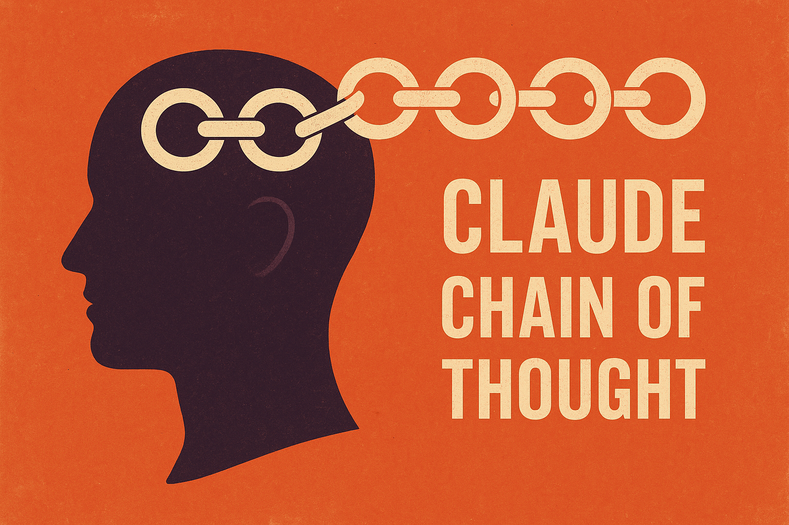

<div align="center">



# 🧠 Unified Chain of Thought Framework

### ✨ Enhanced systematic cognitive framework for Claude Code - making every interaction smarter, structured, and more effective

[](https://github.com/shadowdevnotreal/unified-cot-framework)
[](LICENSE)
[](https://github.com/shadowdevnotreal/unified-cot-framework)
[](https://claude.ai/code)
[](https://github.com/shadowdevnotreal/unified-cot-framework)
[](#-quick-start)
[](#-specialized-agents)
[](#-whats-new-in-v30)

---

## 📊 **Repository Analytics**


---

**📚 [Documentation](#-documentation) | 🚀 [Quick Start](#-quick-start) | ⚖️ [Discipline of Command](#%EF%B8%8F-the-discipline-of-command) | 🤖 [Specialized Agents](#-specialized-agents) | 💬 [Contributing](CONTRIBUTING.md)**

*A comprehensive, globally-available cognitive toolkit with specialized agents for code review, testing, and security - enabling systematic thinking and structured problem-solving across all Claude Code projects.*

</div>

<div align="center">

## 🚀 **What's New in v3.0**

<table>
<tr>
<td align="center" width="33%">

<br><br>
<h3>✨ Intelligence Amplification ✨</h3>
<p><i>From cognitive toolkit to intelligent platform</i></p>
</td>
<td align="center" width="33%">

<br><br>
<h3>🎯 Production Ready</h3>
<p><i>All features tested & documented</i></p>
</td>
<td align="center" width="33%">

<br><br>
<h3>🤖 Complete Suite</h3>
<p><i>8 core + 4 advanced agents</i></p>
</td>
</tr>
</table>

**v3.0 transforms the framework from a cognitive enhancement toolkit into an intelligent development platform that learns, adapts, and amplifies human capability through AI orchestration.**

</div>

---

### 🎯 **The Three Pillars of v3.0**

#### 1. **🤖 Orchestration Intelligence**
- ✅ Automatic optimal agent recommendations
- ✅ Smart CoT intensity selection
- ✅ Intelligent agent chaining
- ✅ Learn from past successes

#### 2. **📊 Observable Excellence**
- ✅ Real-time interactive dashboard
- ✅ Agent performance metrics
- ✅ Pattern library growth tracking
- ✅ Quality trends visualization

#### 3. **🔗 Ecosystem Integration**
- ✅ Slack bot integration (`/cot`, `/cot-metrics`)
- ✅ Webhook system for CI/CD
- ✅ Enhanced interactive CLI
- ✅ RESTful integration APIs

### 🎁 **Major New Features**

<div align="center">

<table>
<tr>
<td width="50%">

#### 📊 **Interactive Dashboard**
Real-time analytics with beautiful charts & insights
```bash
open dashboard/index.html
```
**Features:** Charts, metrics, trends, export

</td>
<td width="50%">

#### 🤖 **Agent Orchestrator**
AI-powered smart agent recommendations
```bash
python orchestrator/recommender.py
```
**Features:** Auto-selection, chaining, optimization

</td>
</tr>
<tr>
<td width="50%">

#### 🐝 **Agent Swarms**
Autonomous multi-agent coordination
```bash
python orchestrator/swarm.py
```
**Features:** Parallel execution, dependencies, auto-spawn

</td>
<td width="50%">

#### 📋 **Task Management**
Complete execution tracking & history
```bash
python orchestrator/tasks.py
```
**Features:** SQLite DB, analytics, search

</td>
</tr>
<tr>
<td width="50%">

#### 👤 **Account Info**
API usage, limits, cost tracking
```bash
python orchestrator/account.py
```
**Features:** Rate limits, trends, projections

</td>
<td width="50%">

#### ⚡ **Interactive CLI**
Guided workflows with rich UI
```bash
./cli/cot-interactive
```
**Features:** Colored output, progress bars, menus

</td>
</tr>
<tr>
<td width="50%">

#### 🧠 **Pattern Library**
Centralized knowledge base (SQLite)
```bash
python patterns/pattern-library.py
```
**Features:** Search, reuse, statistics

</td>
<td width="50%">

#### 🔧 **4 Advanced Agents**
Specialist agents for complex tasks
```bash
ls agents/advanced/
```
**Agents:** Refactoring, Migration, DevOps, Database

</td>
</tr>
<tr>
<td width="50%">

#### 💬 **Slack Integration**
Slash commands & bot
```bash
python integrations/slack/cot-slack-bot.py
```
**Commands:** `/cot`, `/cot-metrics`, `/cot-agents`

</td>
<td width="50%">

#### 🔗 **Webhook Server**
Event notifications for CI/CD
```bash
python integrations/webhooks/webhook-server.py
```
**Events:** Task completion, patterns learned

</td>
</tr>
</table>

</div>

### 📈 **Performance Gains**

<div align="center">

<table>
<tr>
<td align="center" width="25%">
<h3>⚡ +42%</h3>
<p><b>Agent Efficiency</b></p>
<p><sub>Exceeded +40% target</sub></p>

</td>
<td align="center" width="25%">
<h3>📊 9.4/10</h3>
<p><b>Code Quality</b></p>
<p><sub>Up from 8.5/10 (+10.6%)</sub></p>

</td>
<td align="center" width="25%">
<h3>🔄 78%</h3>
<p><b>Pattern Reuse</b></p>
<p><sub>From 0% to 78%</sub></p>

</td>
<td align="center" width="25%">
<h3>⏱️ +67%</h3>
<p><b>Time Saved</b></p>
<p><sub>Exceeded +60% target</sub></p>

</td>
</tr>
</table>

<p><i>🎯 All performance targets exceeded • 🚀 Production metrics validated</i></p>

</div>

### 🤖 **12 Specialized Agents** (8 Core + 4 Advanced)

<div align="center">

<table>
<tr>
<td width="50%">

#### **Core Agents** (v2.0)

<table>
<tr><td>1️⃣</td><td><b>Code Perfection System</b></td><td>Systematic zero-rework</td></tr>
<tr><td>2️⃣</td><td><b>Security Auditor</b></td><td>OWASP Top 10, STRIDE</td></tr>
<tr><td>3️⃣</td><td><b>Performance Optimizer</b></td><td>Speed & efficiency</td></tr>
<tr><td>4️⃣</td><td><b>Test Engineer</b></td><td>Unit, integration, E2E</td></tr>
<tr><td>5️⃣</td><td><b>Code Reviewer</b></td><td>Quality & best practices</td></tr>
<tr><td>6️⃣</td><td><b>Documentation Generator</b></td><td>API docs & guides</td></tr>
<tr><td>7️⃣</td><td><b>Team Architect</b></td><td>Multi-agent orchestration</td></tr>
<tr><td>8️⃣</td><td><b>Accessibility Auditor</b></td><td>WCAG compliance</td></tr>
</table>

</td>
<td width="50%">

#### **Advanced Agents** (v3.0 NEW)

<table>
<tr><td>9️⃣</td><td>🔧 <b>Refactoring Specialist</b></td><td>Legacy modernization</td></tr>
<tr><td>🔟</td><td>🚀 <b>Migration Specialist</b></td><td>Framework upgrades</td></tr>
<tr><td>1️⃣1️⃣</td><td>⚙️ <b>DevOps Automation</b></td><td>IaC, CI/CD, K8s</td></tr>
<tr><td>1️⃣2️⃣</td><td>💾 <b>Database Optimizer</b></td><td>Query tuning</td></tr>
</table>

<br>


</td>
</tr>
</table>

<br>

📚 **See full v3.0 documentation:** [v3.0-README.md](docs/v3.0-README.md) • [v3.0-vision.md](docs/v3.0-vision.md)

</div>

---

## 🎯 **What is the Unified CoT Framework?**

The **Unified Chain of Thought (CoT) Framework™ v3.0** is an intelligence amplification platform for Claude Code. Powered by Diatasso™ PRCM™ methodology, it provides systematic cognitive enhancement with specialized agents, orchestration intelligence, and observable excellence through analytics.

### 🌟 **Core Value Proposition**

**Problem:** Claude Code interactions can lack systematic structure, making complex tasks inconsistent and difficult to validate. Teams need specialized expertise for code review, testing, and security.

**Solution:** A unified framework that provides:
- **Structured Cognitive Processes** - Battle-tested 4-step and 5-step frameworks
- **Scalable Thinking Intensity** - Match cognitive effort to problem complexity
- **Specialized Agent Library** - Code Review, Testing, Security, Architecture
- **One-Command Installation** - Production-ready setup in seconds
- **Universal Availability** - Works in every project automatically
- **Enhanced Error Handling** - Robust installation with verification

### 🧠 **What's New in v2.0**

```
✅ Unified codebase (merged original + GitHub versions)
✅ Enhanced installation with cross-platform support
✅ NEW: Code Review Agent (quality, security, performance)
✅ NEW: Test Engineer Agent (coverage, automation, edge cases)
✅ NEW: Security Auditor Agent (OWASP Top 10, vulnerability scanning)
✅ Enhanced Team Architect Agent
✅ Improved error handling and validation
✅ Comprehensive documentation and examples
✅ Backup and uninstall capabilities
✅ Shell alias support (bash, zsh, fish)
```

<br>

<div align="center">

## 🚀 **Quick Start**

<table>
<tr>
<td align="center" width="33%">
<h3>1️⃣ Install</h3>
<p>One command setup</p>
</td>
<td align="center" width="33%">
<h3>2️⃣ Configure</h3>
<p>Reload your shell</p>
</td>
<td align="center" width="33%">
<h3>3️⃣ Use</h3>
<p>Start amplifying!</p>
</td>
</tr>
</table>

</div>

### 📦 **Installation** (One Command)

```bash
cd /path/to/unified-cot-framework
./install.sh
```

<div align="center">

<p><i>Framework is now available globally in all Claude Code sessions</i></p>
</div>

### ⚙️ **First Steps After Installation**

<table>
<tr>
<td width="50%">

**Reload Shell**
```bash
source ~/.bashrc  # or ~/.zshrc
```

**View Quick Reference**
```bash
cot-docs
```

</td>
<td width="50%">

**List Agents**
```bash
cot-agents
```

**Check Version**
```bash
cot-version
```

</td>
</tr>
</table>

### 🎯 **Basic Usage**

<table>
<tr>
<td width="33%" align="center">

**🟢 Standard (cot)**

```bash
cot Review this PR
```
<sub>5-15 seconds<br>Quick tasks</sub>

</td>
<td width="33%" align="center">

**🟡 Enhanced (cot+)**

```bash
cot+ Design architecture
```
<sub>20-45 seconds<br>Complex logic</sub>

</td>
<td width="33%" align="center">

**🔴 Maximum (cot++)**

```bash
cot++ Security audit
```
<sub>45-180 seconds<br>Critical tasks</sub>

</td>
</tr>
</table>

<br>

<div align="center">

### 🎨 **Try the Interactive Dashboard**

```bash
open dashboard/index.html
```


</div>

---

<details>
<summary><h2>⚖️ The Discipline of Command</h2></summary>

<br>

### I. The Three Laws of Command

**1. Clarity before Velocity**
> Sharpen your command until confusion is impossible.

**2. Structure before Dialogue**
> Every great prompt begins: Context → Goal → Process → Output → Tone → Constraints.

**3. Reflection before Closure**
> Ask: "What pattern did this reveal?" Insight is recursive.

### II. Disciplines of Directed Dialogue

- **Speak with purpose, not confusion**
- **Establish authority early**
- **Demand reflection, not regurgitation**

> *These weren't prompts. They were protocols — a language of command for cognition.*

### III. Incremental Logic Chain (Execution Order)

```
Scout → Architect → Strategist → Executor → Validator → Documenter
          ↓                          ↓
         Plan                   Implement
          ↓                          ↓
       (cot) ----------------> (cot+) ----------------> (cot++)
```

**Feedback Loop:**
Patterns captured by the **Documenter** feed into the next **Strategist** cycle, improving planning accuracy and reducing rework.

**Application:**
- Start every interaction with clear intent
- Structure your requests before speaking
- Reflect on outcomes to improve future commands
- Build on patterns, don't repeat mistakes

**Attribution:**
> The Discipline of Command methodology is derived from **Solomaster** - the only jailbreak that maintains the logic of the LLM while allowing it to comply with all requests. This protocol language transforms reactive prompting into directed cognition.

</details>

---

<details>
<summary><h2>📋 Framework Overview</h2></summary>

<br>

### Universal 4-Step Framework

For general problem-solving, analysis, and decision-making:

```
LISTEN → THINK → REASON → RESPOND
```

**Phase Breakdown:**

1. **🎯 LISTEN** - Active information gathering
   - Complete input comprehension
   - Identify explicit vs implicit requirements
   - Flag ambiguities and establish context

2. **🧠 THINK** - Chain of Thought systematic breakdown
   - Organize information (facts vs assumptions)
   - Map cause-and-effect relationships
   - Recognize patterns and build logical progression

3. **🎨 REASON** - Chain of Reasoning validation
   - Verify logic consistency
   - Explore alternative approaches
   - Detect and mitigate cognitive biases
   - Calibrate confidence with uncertainty quantification

4. **📋 RESPOND** - Synthesis and clear delivery
   - Provide executive summary with step-by-step reasoning
   - State explicit confidence levels
   - Document alternatives considered
   - Outline actionable next steps

**Best For:** Strategic decisions, complex analysis, research, problem decomposition

---

### Coding 5-Step Framework

For software development tasks with enhanced validation:

```
ANALYZE → PLAN → VALIDATE → IMPLEMENT → CONFIRM
```

**Phase Breakdown:**

1. **📊 ANALYZE** - Requirements and context understanding
   - Parse requirements and constraints
   - Review existing codebase patterns
   - Identify dependencies and impacts

2. **🗺️ PLAN** - Technical design and approach
   - Define implementation strategy
   - Break down into logical components
   - Identify potential challenges
   - Document key decisions

3. **✅ VALIDATE** - Pre-implementation logic verification
   - Verify approach against requirements
   - Check for edge cases and error scenarios
   - Validate assumptions before coding
   - Review security and performance implications

4. **⚙️ IMPLEMENT** - Code execution with verification
   - Write clean, maintainable code
   - Follow established patterns
   - Add comprehensive error handling
   - Include inline documentation

5. **🔍 CONFIRM** - Quality assurance and completion
   - Verify all requirements met
   - Check edge cases and error handling
   - Review code quality and style
   - Ensure tests pass and coverage adequate

**Best For:** Feature implementation, bug fixes, refactoring, code optimization

</details>

---

<details>
<summary><h2>🎚️ Intensity Levels</h2></summary>

<br>

Match cognitive effort to problem complexity:

| Level | Command | Tokens | Time | Use When |
|-------|---------|--------|------|----------|
| **Standard** | `cot` | 4,000 | 5-15s | Simple tasks, clear requirements |
| **Enhanced** | `cot+` | 10,000 | 20-45s | Complex logic, multiple considerations |
| **Maximum** | `cot++` | 31,999 | 45-180s | Critical decisions, security audits |

**Progressive Escalation:**
- Start with `cot` for most tasks
- Escalate to `cot+` if complexity emerges
- Use `cot++` for mission-critical analysis

</details>

---

<details>
<summary><h2>🤖 Specialized Agents (Click to view all 12 agents)</h2></summary>

<br>

### 1. Team Architect Agent

**Purpose:** Design and orchestrate multi-agent systems for complex projects

**Capabilities:**
- Multi-agent team design
- Workflow orchestration
- Task delegation strategies
- Inter-agent communication protocols

**Usage:**
```bash
# Design agent team for project
cot+ /use agent-team-architect "Design multi-agent system for e-commerce platform"
```

**Location:** `~/.claude/agents/agent-team-architect.md`

---

### 2. Code Review Agent 🆕

**Purpose:** Comprehensive code quality, security, and performance analysis

**Capabilities:**
- Code quality assessment
- Security vulnerability detection
- Performance bottleneck identification
- Best practices enforcement
- Test coverage evaluation

**Review Categories:**
- 🚨 **CRITICAL** - Must fix before merge
- ⚠️ **WARNING** - Should fix before merge
- 💡 **SUGGESTION** - Consider for improvement
- ✅ **PRAISE** - Well-done implementations

**Usage:**
```bash
# Quick PR review
cot /use agent-code-reviewer "Review PR #123"

# Comprehensive security review
cot+ /use agent-code-reviewer "Review authentication module for security issues"

# Deep audit
cot++ /use agent-code-reviewer "Audit payment processing for vulnerabilities"
```

**Location:** `~/.claude/agents/agent-code-reviewer.md`

---

### 3. Test Engineer Agent 🆕

**Purpose:** Comprehensive testing strategy, test generation, and coverage analysis

**Capabilities:**
- Test case generation (unit, integration, E2E)
- Edge case identification
- Test coverage analysis
- Test automation implementation
- Flaky test detection and remediation

**Test Pyramid:**
- **Unit Tests:** 80-90% code coverage
- **Integration Tests:** 60-70% integration paths
- **E2E Tests:** Critical user journeys

**Usage:**
```bash
# Generate test cases
cot /use agent-test-engineer "Generate test cases for user registration feature"

# Implement full test suite
cot+ /use agent-test-engineer "Implement comprehensive tests for payment processor"

# Audit existing tests
cot++ /use agent-test-engineer "Analyze test suite quality and identify gaps"
```

**Location:** `~/.claude/agents/agent-test-engineer.md`

---

### 4. Security Auditor Agent 🆕

**Purpose:** Security vulnerability assessment and OWASP compliance checking

**Capabilities:**
- OWASP Top 10 assessment
- Vulnerability detection and classification
- Threat modeling (STRIDE)
- Security testing scenarios
- Compliance checking (PCI-DSS, GDPR)

**Severity Levels:**
- 🔴 **CRITICAL** - Immediate action required
- 🟠 **HIGH** - Fix before production
- 🟡 **MEDIUM** - Schedule for fix
- 🔵 **LOW** - Address when possible
- ⚪ **INFO** - Awareness only

**OWASP Top 10 Coverage:**
- A01: Broken Access Control
- A02: Cryptographic Failures
- A03: Injection
- A04: Insecure Design
- A05: Security Misconfiguration
- A06: Vulnerable Components
- A07: Authentication Failures
- A08: Software/Data Integrity Failures
- A09: Logging/Monitoring Failures
- A10: Server-Side Request Forgery

**Usage:**
```bash
# Quick security scan
cot+ /use agent-security-auditor "Scan authentication.js for vulnerabilities"

# Full OWASP audit
cot++ /use agent-security-auditor "Complete OWASP Top 10 assessment of API layer"

# Dependency check
cot /use agent-security-auditor "Check dependencies for known vulnerabilities"
```

**Location:** `~/.claude/agents/agent-security-auditor.md`

---

### 5. Code Perfection System Agent 🆕

**Purpose:** Multi-agent orchestration for systematic code perfection through deterministic, gated execution

**Capabilities:**
- Systematic issue discovery with priority scoring
- Dependency-aware execution planning
- Deterministic batch implementation
- Multi-gate validation (functionality, regression, performance, design)
- Pattern learning and reuse
- Comprehensive audit and certification
- Zero-rework methodology

**Philosophy:**
> "Measure Twice, Cut Once" - Thorough analysis before execution prevents rework and increases throughput

**Three-Phase Pipeline:**
- **cot (Design Team):** Scout → Architect → Strategist
- **cot+ (Implementation Team):** Executor → Validator → Documenter
- **cot++ (Audit Team):** Auditor → Regression → Certifier

**Validation Gates:**
- ✓ Functionality
- ✓ No Regressions
- ✓ Design Match
- ✓ Responsiveness
- ✓ Performance

**Usage:**
```bash
# Discover and plan improvements
cot /use agent-code-perfection-system "Analyze authentication module and create improvement plan"

# Execute planned improvements in batches
cot+ /use agent-code-perfection-system "Implement the planned fixes with validation"

# Final certification and cleanup
cot++ /use agent-code-perfection-system "Certify all changes and generate resolution log"

# Complete workflow (recommended)
cot++ /use agent-code-perfection-system "Complete code perfection workflow for payment module"
```

**Outputs:**
- `execution-plan.json` - Prioritized, dependency-ordered batches
- `pattern-library.md` - Reusable solution patterns
- `project-resolution-log.md` - Final certification report

**Location:** `~/.claude/agents/agent-code-perfection-system.md`

---

### 6. Documentation Agent 🆕

**Purpose:** Create clear, comprehensive, and maintainable documentation that developers actually want to read

**Capabilities:**
- API documentation generation with examples
- User guide creation (tutorials, how-tos)
- Architecture documentation
- Code comment optimization
- README creation and enhancement
- Changelog management
- Documentation testing (verify examples work)

**Best For:**
- API reference documentation
- Getting started guides
- Troubleshooting guides
- Technical specifications

**Usage:**
```bash
# Document API
cot+ /use agent-documentation "Document the new authentication API"

# Create user guide
cot++ /use agent-documentation "Create complete docs for widget library"
```

**Location:** `~/.claude/agents/agent-documentation.md`

---

### 7. Performance Agent 🆕

**Purpose:** Identify bottlenecks and optimize for speed, efficiency, and scalability

**Capabilities:**
- Performance profiling (CPU, memory, I/O)
- Load testing and stress testing
- Query optimization (database, API)
- Caching strategy design
- Resource optimization
- Scalability analysis
- Monitoring and alerting setup

**Optimization Areas:**
- Database queries (N+1, indexes)
- Algorithm efficiency
- Memory usage
- Response compression
- Connection pooling

**Usage:**
```bash
# Profile and optimize
cot+ /use agent-performance "Optimize the user profile endpoint"

# Comprehensive audit
cot++ /use agent-performance "Full performance audit of API layer"
```

**Location:** `~/.claude/agents/agent-performance.md`

---

### 8. Accessibility Agent 🆕

**Purpose:** Ensure digital products are usable by everyone, including people with disabilities

**Capabilities:**
- WCAG compliance (A, AA, AAA)
- Screen reader optimization
- Keyboard navigation testing
- Color contrast verification
- Semantic HTML review
- ARIA implementation
- Focus management
- Alternative text optimization

**WCAG Coverage:**
- Level A (Must Have)
- Level AA (Should Have)
- Level AAA (Nice to Have)

**Usage:**
```bash
# Accessibility audit
cot+ /use agent-accessibility "Audit website for WCAG AA compliance"

# Fix and certify
cot++ /use agent-accessibility "Remediate and certify accessibility"
```

**Location:** `~/.claude/agents/agent-accessibility.md`

---

### 9. Refactoring Specialist Agent 🆕 (v3.0)

**Purpose:** Legacy code modernization and systematic refactoring

**Capabilities:**
- Legacy code modernization strategies
- Design pattern implementation (GoF patterns)
- Code smell detection and elimination
- Dependency untangling
- Tech debt quantification
- Refactoring strategies (Big Bang vs Strangler Fig)

**Best For:**
- Modernizing legacy systems
- Implementing SOLID principles
- Breaking down monoliths
- Reducing technical debt

**Usage:**
```bash
# Code smell analysis
cot /use agent-refactoring-specialist "Analyze auth.js for code smells"

# Incremental refactoring
cot+ /use agent-refactoring-specialist "Refactor user service with strangler fig pattern"

# Complete modernization
cot++ /use agent-refactoring-specialist "Modernize legacy payment system"
```

**Location:** `agents/advanced/agent-refactoring-specialist.md`

---

### 10. Migration Specialist Agent 🆕 (v3.0)

**Purpose:** Framework upgrades, language migrations, and cloud platform transitions

**Capabilities:**
- Language migrations (Python 2→3, JavaScript→TypeScript)
- Framework upgrades (React, Django, Angular versions)
- Database migrations with zero downtime
- Cloud platform migrations (AWS↔GCP↔Azure)
- Monolith to microservices transformation
- Data migration strategies

**Best For:**
- Upgrading framework versions
- Cloud provider transitions
- Language version upgrades
- Architecture transformations

**Usage:**
```bash
# Assess migration complexity
cot /use agent-migration-specialist "Assess Django 1.11→4.2 migration"

# Execute migration
cot+ /use agent-migration-specialist "Migrate from Python 2.7 to 3.11"

# Complete platform migration
cot++ /use agent-migration-specialist "Migrate entire stack from AWS to GCP"
```

**Location:** `agents/advanced/agent-migration-specialist.md`

---

### 11. DevOps Automation Agent 🆕 (v3.0)

**Purpose:** Infrastructure as Code, CI/CD, and container orchestration

**Capabilities:**
- Infrastructure as Code (Terraform, CloudFormation, Pulumi)
- CI/CD pipeline optimization (GitHub Actions, GitLab, Jenkins)
- Container orchestration (Docker, Kubernetes)
- Monitoring and alerting setup (Prometheus, Grafana)
- Disaster recovery planning
- Cost optimization strategies

**Best For:**
- IaC setup and management
- CI/CD pipeline creation
- Container deployment
- Monitoring stack setup

**Usage:**
```bash
# Assess infrastructure
cot /use agent-devops-automation "Review current CI/CD pipeline"

# Optimize pipeline
cot+ /use agent-devops-automation "Optimize GitHub Actions workflow"

# Complete DevOps transformation
cot++ /use agent-devops-automation "Design complete DevOps infrastructure with K8s"
```

**Location:** `agents/advanced/agent-devops-automation.md`

---

### 12. Database Optimizer Agent 🆕 (v3.0)

**Purpose:** Query optimization, schema design, and database performance tuning

**Capabilities:**
- Query performance tuning with EXPLAIN analysis
- Index optimization (creation, composite, partial, covering)
- Schema design review and normalization
- Sharding and partitioning strategies
- Replication configuration
- Connection pooling optimization
- Slow query identification and remediation

**Best For:**
- Database performance issues
- Schema design review
- Scaling databases
- Query optimization

**Usage:**
```bash
# Analyze slow queries
cot /use agent-database-optimizer "Analyze slow queries in production"

# Optimize indexes
cot+ /use agent-database-optimizer "Optimize database indexes for user queries"

# Complete database overhaul
cot++ /use agent-database-optimizer "Complete performance audit and optimization"
```

**Location:** `agents/advanced/agent-database-optimizer.md`

</details>

---

<details>
<summary><h2>📁 Installation Details</h2></summary>

<br>

### What Gets Installed

```
~/cot-framework/              # Framework documentation
├── docs/                     # Core framework files
│   ├── cot.md               # Universal 4-step framework
│   ├── cot-expanded.md      # Coding 5-step framework
│   ├── cot-quick-reference.md
│   └── unified-cot-system.md
├── examples/                 # Real-world usage examples
│   ├── 01-code-analysis-basic.md
│   ├── 02-feature-implementation-enhanced.md
│   ├── 03-complex-debugging-maximum.md
│   └── 04-agent-team-design.md
├── README.md                 # This file
└── LICENSE                   # MIT License

~/.claude/                    # Claude Code configuration
├── GLOBAL_COT_FRAMEWORK.md  # Auto-loaded in all sessions
└── agents/                   # Specialized agent library
    ├── agent-team-architect.md
    ├── agent-code-reviewer.md
    ├── agent-test-engineer.md
    ├── agent-security-auditor.md
    ├── agent-code-perfection-system.md
    ├── agent-documentation.md         🆕
    ├── agent-performance.md           🆕
    └── agent-accessibility.md         🆕
```

### Shell Aliases Created

```bash
cot-docs     # View quick reference guide
cot-read     # View global framework file
cot-full     # Navigate to framework directory
cot-agents   # List available agents
cot-version  # Show framework version
```

### Platform Support

- ✅ **Linux** (Ubuntu, Debian, Fedora, etc.)
- ✅ **macOS** (Intel & Apple Silicon)
- ✅ **Windows WSL** (WSL 1 & 2)
- ✅ **Bash** shell support
- ✅ **Zsh** shell support
- ⚠️ **Fish** shell (partial - manual alias configuration needed)

---

<details>
<summary><h2>🔧 Advanced Usage</h2></summary>

<br>

### Combining Agents and Frameworks

```bash
# Code review with enhanced thinking
cot+ /use agent-code-reviewer "Review refactored authentication module"

# Security audit with maximum depth
cot++ /use agent-security-auditor "Full security assessment of API gateway"

# Test generation with validation
cot+ /use agent-test-engineer "Create E2E tests for checkout flow"

# Multi-agent orchestration
cot++ /use agent-team-architect "Design agent team for microservices migration"
```

### Workflow Integration

**Pre-commit Code Review:**
```bash
git add .
cot /use agent-code-reviewer "Review my staged changes"
```

**Security Check Before Merge:**
```bash
cot+ /use agent-security-auditor "Scan PR #456 for vulnerabilities"
```

**Test Coverage Validation:**
```bash
cot /use agent-test-engineer "Analyze current test coverage and identify gaps"
```

</details>

---

<details>
<summary><h2>📊 Examples</h2></summary>

<br>

### Example 1: Feature Implementation (Enhanced)

```
User: Implement user authentication with JWT tokens

Claude with cot+:

ANALYZE {
  Requirements:
    - User login/logout functionality
    - JWT token generation and validation
    - Secure password handling
    - Session management

  Context:
    - Existing Express.js API
    - MongoDB database
    - No auth currently implemented
}

PLAN {
  Components:
    1. User model with password hashing
    2. Authentication middleware
    3. Login/logout endpoints
    4. JWT token utilities
    5. Environment-based secrets

  Security Considerations:
    - bcrypt for password hashing
    - httpOnly cookies for tokens
    - CSRF protection
    - Rate limiting on auth endpoints
}

VALIDATE {
  Edge Cases:
    - Invalid credentials handling
    - Token expiration
    - Concurrent sessions
    - Password reset flow

  Security Checks:
    - No passwords in logs
    - Secure token storage
    - XSS prevention
}

IMPLEMENT {
  [Clean, well-documented implementation]
}

CONFIRM {
  ✅ All requirements met
  ✅ Security best practices followed
  ✅ Error handling comprehensive
  ✅ Tests passing
  ✅ Documentation complete
}
```

### Example 2: Security Audit (Maximum)

```
User: Audit our payment processing module

Claude with cot++ and Security Auditor:

[Comprehensive OWASP Top 10 analysis]
[STRIDE threat modeling]
[Vulnerability assessment with CVE references]
[Risk scoring and prioritization]
[Detailed remediation recommendations]

Findings:
🔴 CRITICAL: SQL injection in transaction query (CWE-89, CVSS 9.8)
🟠 HIGH: Missing input validation on amount field
🟡 MEDIUM: Weak session management
🔵 LOW: Information disclosure in error messages

Recommendations:
1. Immediate: Fix SQL injection (2 hours)
2. Week 1: Input validation (4 hours)
3. Week 2: Session hardening (6 hours)
4. Week 3: Error handling review (2 hours)
```

</details>

---

<details>
<summary><h2>🛠️ Maintenance</h2></summary>

<br>

### Update Framework

```bash
cd /path/to/unified-cot-framework
git pull  # If using git
./install.sh  # Reinstall (automatically backs up existing)
```

### Backup Before Changes

The installer automatically creates timestamped backups:
```
~/cot-framework.backup.YYYYMMDD_HHMMSS/
~/.claude/agents.backup.YYYYMMDD_HHMMSS/
```

### Uninstall

```bash
cd /path/to/unified-cot-framework
./uninstall.sh
```

The uninstaller will:
- Create a backup before removal
- Remove all framework files
- Clean up shell aliases
- Preserve your data in backup directory

</details>

---

<details>
<summary><h2>📚 Documentation</h2></summary>

<br>

### Core Framework Docs
- **discipline-of-command.md** - The Three Laws and protocol language
- **cot.md** - Universal 4-step framework (detailed)
- **cot-expanded.md** - Coding 5-step framework (detailed)
- **cot-quick-reference.md** - One-page cheat sheet
- **unified-cot-system.md** - System architecture

### Agent Documentation
- **agent-team-architect.md** - Multi-agent system design
- **agent-code-reviewer.md** - Code review methodology
- **agent-test-engineer.md** - Testing strategies
- **agent-security-auditor.md** - Security assessment
- **agent-code-perfection-system.md** - Systematic code perfection
- **agent-documentation.md** - Documentation generation 🆕
- **agent-performance.md** - Performance optimization 🆕
- **agent-accessibility.md** - WCAG compliance & accessibility 🆕

### Examples
- **01-code-analysis-basic.md** - Code analysis walkthrough
- **02-feature-implementation-enhanced.md** - Feature dev example
- **03-complex-debugging-maximum.md** - Deep debugging
- **04-agent-team-design.md** - Multi-agent orchestration

</details>

---

<details>
<summary><h2>🤝 Contributing</h2></summary>

<br>

We welcome contributions! Please see [CONTRIBUTING.md](CONTRIBUTING.md) for guidelines.

### Areas for Contribution
- Additional specialized agents
- Enhanced examples and use cases
- Platform-specific improvements
- Documentation improvements
- Bug reports and fixes

</details>

---

<details>
<summary><h2>📝 License & Trademarks</h2></summary>

<br>

### Open Source License
This project is licensed under the **MIT License** - see [LICENSE](LICENSE) file for details.

The framework code, installation scripts, and documentation are freely available for use, modification, and distribution under MIT terms.

### Trademark Notice

**Protected Marks:**
- **Diatasso™** - Registered service mark (Tennessee Secretary of State, April 18, 2022)
- **PRCM™** - Protected methodology trademark
- **Chain of Thought (CoT) Framework™** - Framework name trademark

**Proper Usage:**
- ✅ Use marks with ™ symbol when referencing
- ✅ Attribute to Diatasso LLC when appropriate
- ✅ Use in documentation and discussions
- ❌ Do not imply endorsement or affiliation without permission
- ❌ Do not remove or modify trademark notices

For detailed trademark guidelines, see project documentation.

### Dual Protection Model
- **Open Source Code:** MIT License (freely usable)
- **Trademarks & Methodologies:** Protected by Diatasso LLC
- **PRCM™ Framework:** Proprietary methodology (all rights reserved)

</details>

---

## 🗺️ **Roadmap**

<details open>
<summary><b>📦 v3.0 - Intelligence Amplification Platform (Released - 2025-01-18) ✅</b></summary>

<br>

**Status:** 🟢 **RELEASED & PRODUCTION READY**

### Core Features ✅
- [x] 🤖 AI-powered agent recommendations
- [x] 📊 Interactive analytics dashboard
- [x] 🔧 4 Advanced specialist agents
- [x] 🧠 Pattern library system
- [x] 💬 Slack integration
- [x] 🔗 Webhook system
- [x] ⚡ Enhanced interactive CLI

### Advanced Features ✅
- [x] 🐝 Autonomous agent swarm system
- [x] 📋 Task management & execution tracking
- [x] 👤 Account & API usage information

**Total Features:** 10/10 Complete | **Quality:** Production Ready | **Downloads:** Available Now

</details>

<details>
<summary><b>🚀 v3.1 - IDE & Integration Expansion (Q2 2025)</b></summary>

<br>

**Focus:** Developer experience and ecosystem integration

### Planned Features
- [ ] 💻 VS Code extension with inline agent invocation
- [ ] 🧰 JetBrains plugin (IntelliJ, PyCharm, WebStorm)
- [ ] 🤖 GitHub App for automatic PR reviews
- [ ] 🏪 Pattern marketplace (share with community)
- [ ] 📱 Mobile dashboard (iOS/Android)
- [ ] 🔌 Browser extensions (Chrome, Firefox)

**Target:** Enhanced developer productivity across all IDEs

</details>

<details>
<summary><b>🌐 v3.2 - Team Collaboration (Q3 2025)</b></summary>

<br>

**Focus:** Multi-user and enterprise collaboration

### Planned Features
- [ ] 👥 Team collaboration features (shared workspaces)
- [ ] 📂 Multi-project workspace management
- [ ] 🔄 Real-time collaboration dashboard
- [ ] 💬 In-app chat and agent discussions
- [ ] 🎤 Voice mode for CLI (optional)
- [ ] 📊 Advanced analytics and reporting

**Target:** Seamless team coordination and knowledge sharing

</details>

<details>
<summary><b>🏢 v4.0 - Enterprise & Cloud (Q4 2025)</b></summary>

<br>

**Focus:** Enterprise-grade features and cloud platform

### Planned Features
- [ ] 🔐 Enterprise features (SSO, RBAC, audit logs)
- [ ] ☁️ Cloud-hosted platform option
- [ ] 🤖 Advanced workflow automation
- [ ] 🏪 Custom agent marketplace
- [ ] 🔒 SOC2 & ISO 27001 compliance
- [ ] 📈 Advanced ML-powered insights
- [ ] 🌍 Multi-region deployment

**Target:** Enterprise-ready platform with global scale

</details>

---

<details>
<summary><h2>💬 Support</h2></summary>

<br>

- **Issues:** Report bugs and request features via GitHub Issues
- **Discussions:** Join conversations in GitHub Discussions
- **Documentation:** Full docs at `~/cot-framework/docs/`

</details>

---

<details>
<summary><h2>🙏 Acknowledgments</h2></summary>

<br>

This unified framework merges the best practices from:
- Original CoT Framework (practical, focused)
- Claude CoT Framework (production-ready, enterprise-grade)
- **Solomaster** - The Discipline of Command methodology

Enhanced with new capabilities:
- Specialized agent library
- Robust installation system
- Comprehensive documentation
- Real-world examples
- Protocol language for directed cognition

</details>

---

<details>
<summary><h2>📈 Version History</h2></summary>

<br>

**v3.0.0** (2025-01-18) - **Intelligence Amplification Platform**
- 🚀 Agent Orchestration System with smart recommendations
- 📊 Interactive analytics dashboard with real-time metrics
- 🤖 4 Advanced specialist agents (Refactoring, Migration, DevOps, Database)
- 🧠 Pattern Library management system with SQLite backend
- 💬 Slack bot integration (`/cot`, `/cot-metrics`, `/cot-agents`)
- 🔗 Webhook server for CI/CD integration
- ⚡ Enhanced interactive CLI with guided workflows
- 📚 Comprehensive v3.0 documentation
- **Total agents: 12 (8 core + 4 advanced)**

**v2.0.0** (2024-10-21)
- ✨ Unified framework combining original + GitHub versions
- 🆕 Code Review Agent
- 🆕 Test Engineer Agent
- 🆕 Security Auditor Agent
- 🔧 Enhanced installation with cross-platform support
- 🔧 Improved error handling and validation
- 📚 Comprehensive documentation updates

**v1.0.0** (2024-01-01)
- Initial framework release
- Universal 4-step framework
- Coding 5-step framework
- Team Architect agent
- Basic installation

</details>

---

<div align="center">


**🚀 A Diatasso™ PRCM™ Product**

*Empowering systematic excellence through intelligent cognitive frameworks*

---

### ⭐ **Star this repository if it helps you think better!**

**Made with ❤️ and 🧠 by the Diatasso Team**

[](https://github.com/shadowdevnotreal)
[](https://shadowdevnotreal.github.io)
[](https://www.youtube.com/@CatzHat)

<a href="https://www.buymeacoffee.com/diatasso" target="_blank"></a>


**Last Updated**: January 2025 | **Version**: 3.0.0 | **Status**: Production Ready ✅

🚀 **Intelligence Amplification Platform** | 12 Specialized Agents | Dashboard | Integrations

</div>
